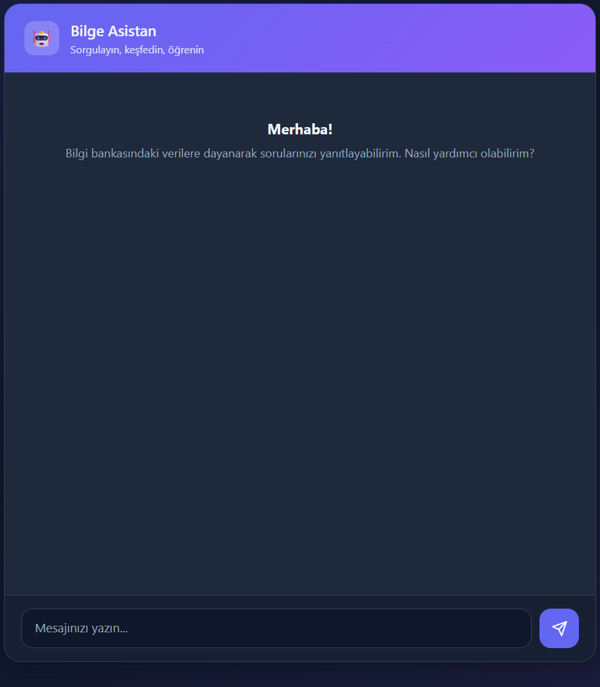

# Bilge Asistan

RAG-based PHP chatbot. Responses are grounded in a **MySQL knowledge base** before the model generates an answer, which reduces hallucinations.

<p align="center">
  
</p>

**Developer:** Neşe Sağır

## Overview

When a user asks a question, Bilge Asistan reads text from the `bilgi_bankasi` table and sends it to the OpenAI API as **context**. The goal is to base answers on verified knowledge-base content rather than open-ended model guesses.

**Why a database?**  
Instead of sending the question directly to the model, the app retrieves stored records first. The bot then uses project-specific facts instead of inventing details — the core idea behind RAG (Retrieval-Augmented Generation).

## Tech Stack

| Layer | Technology |
|-------|------------|
| Backend | PHP, PDO |
| Database | MySQL (`bilgi_bankasi`) |
| Frontend | HTML, CSS, JavaScript |
| API | OpenAI GPT-3.5-turbo |
| Server | XAMPP (Apache) |
| Launcher | Windows Batch (`BASLAT.bat`) |

## Architecture

```
User → UI → PHP → MySQL (bilgi_bankasi) → Context → OpenAI API → Response
```

## Setup

1. Copy the project to `C:\xampp\htdocs\llm_proje\`
2. Start Apache and MySQL in XAMPP
3. Import `veritabani.sql` in phpMyAdmin
4. Set your OpenAI API key in the `$api_key` variable in `index.php`
5. Open [http://localhost/llm_proje/](http://localhost/llm_proje/) in your browser

## Database

- **Database:** `llm_proje`
- **Table:** `bilgi_bankasi`
- **Host:** `localhost`
- **User:** `root`

## Project Structure

```
├── index.php          # Application (PHP + HTML + CSS + JS)
├── sohbet-ekrani.png  # Chat UI screenshot
├── veritabani.sql     # Schema and knowledge-base seed data
├── BASLAT.bat         # Dev/demo launcher (XAMPP, browser, phpMyAdmin, VS Code)
└── README.md
```

## License

This project was built for educational purposes.
